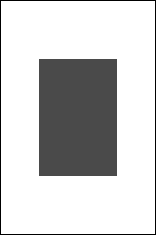

### What autolayout rules should be added to make this UIView appear at runtime as it does below?



---

### What autolayout rules should be added to make this UIView appear at runtime as it does below?

1. centered horizontally
1. centered vertically
1. proportional width 0.5 of view
1. proportional height 0.5 of view

---

### If you have two different cell prototypes in your storyboard, how do you differentiate them in the ```cellForRowAtIndexPath``` method to load the correct type?

---

### If you have two different cell prototypes in your storyboard, how do you differentiate them in the ```cellForRowAtIndexPath``` method to load the correct type?

Reuse Identifier

---

### Where do IBOutlets for a cell using the custom style belong?

---

### Where do IBOutlets for a cell using the custom style belong?

Custom UITableViewCell subclass 