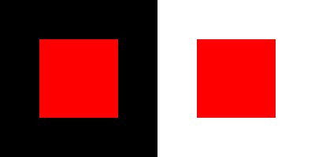
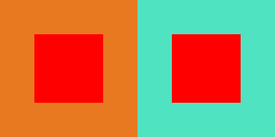
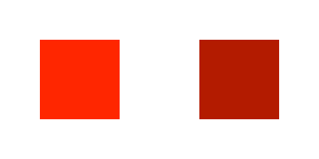
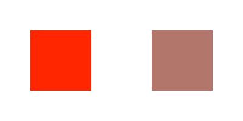

# Design Fundamentals for a Digital World

---

# Considerations

* Layout
* Color
* Typography
* Affordances

---

## Layout

### The overall structure/scaffolding

---

### It can also pertain to smaller considerations, like how arrange information on the screen and the visual hierarchy you create with your UI chrome.

---

---

## Color

---

- Can inform or confound your users
- Can emphasize or understate your content

---

# Red

^ Red is more brilliant when overlayed on a black background. It's lifeless against orange, and once again pops when over blue-green. It also appears bigger when over black.

---

---

## Some Terminology

---
* _Hue_ - Value from color wheel (spectrum of light)
* _Saturation_ - purity or vividness
* _Brightness_ - light to dark
* _Tint_ - Add white to a hue
* _Shade_ - Add black to a hue
* _Tone_ - Add grey to a hue

^ HSB are for digital applications, TST is from the world of painting. Hue represents a pure color (e.g. red). Saturation refers to purity or vividness of color (pure to grey, at a constant brightness). Brightness is dark (black) to fully illuminated.

---

^ Tint - add white
Shade - add black
Tone - add grey

---

## Typography

---

### Possibly the most important aspect of digital design, especially for web and app developers, as most websites and many apps are predominantly text.

---

## Typography has one plain duty before it and that is to convey information in writing. No argument or consideration can absolve typography from this duty. A printed work which cannot be read becomes a product without purpose.
--Emil Ruder 1969, Swiss typographer

---

# Explore Typography

* [Series of posts about web typography, good primer](http://advancedwebtypography.com)
* [Great site that shows examples of font pairings from around the web](https://typ.io)
* [Karen Kavett's intro to typography video](https://www.youtube.com/watch?v=tWFWJGA7qrc)

---

## Affordances

---

### An affordance is often taken as a relation between an object or an environment and an organism, that affords the opportunity for that organism to perform an action. For example, a knob affords twisting, and perhaps pushing, while a cord affords pulling. As a relation, an affordance exhibits the possibility of some action, and is not a property of either an organism or its environment alone.
-- [Wikipedia definition](https://en.wikipedia.org/wiki/Affordance)

---

# Explore Design

* [How to get better at UI/UX design](http://ui-patterns.com/blog/How-to-get-better-at-UI-design)
* [Pixel Perfect Precision](http://ustwo.com/ppp/)
* [UI Design for Developers](http://code.tutsplus.com/tutorials/ui-design-for-developers-introduction--active-9921)
* [On Creative Direction](http://danielmall.com/articles/on-creative-direction/)
* [What Screens Want](http://www.frankchimero.com/writing/what-screens-want/)

---

# Cont'd

* [Color Theory for Designers, Part 1](http://www.smashingmagazine.com/2010/01/28/color-theory-for-designers-part-1-the-meaning-of-color/)
* [Find Brand Guidelines](http://findguidelin.es)
* [Pttrns - Mobile Design Examples](http://pttrns.com)
* [Hue color test](http://www.xrite.com/online-color-test-challenge)

---

# Explore Sketch

* [Sketch Homepage - Bohemian Coding](http://www.bohemiancoding.com)
* [Quickly create a color palette in Sketch](http://www.sketchcasts.net/episodes/quickly-create-a-color-palette)
* [General Sketch tutorials](http://leveluptuts.com/tutorials/sketch-3-tutorials)
* [Sketch App Sources](http://www.sketchappsources.com)
